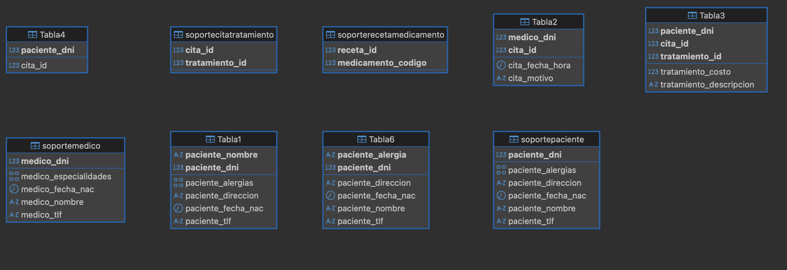

# CRUD Cassandra y Python
## Sistemas de almacenamiento - Actividad 2
#### Autor: Camilo Martinez

Este README.md tiene como objectivo dar el detalle de la implementación realizada con un cluster de Cassandra 3.11, montado en docker, python 3.10 para la comunicación y automatización de procesos, y Dbeaver como entorno de trabajo de Cassandra.

El alcance de este trabajo se resume a continuación:
- Construir una conexión al cluster de cassandra, local, desde python.
- Creación de modelo lógico a partir del conceptual que satisfaga las consultas requeridas.
- Generar un CRUD inicial para poder interactuar con las distintas tablas y relaciones. Vea el modelo conceptual para más detalles.
- Generar un menú por consola para poder hacer el llamado de las funciones del CRUD.
- Creación de tablero con Streamlit para poder realizar y visualizar las operaciones CRUD de una forma más visual e interactiva.

### Modelo Conceptual
---

### Modelo lógico

Consultas a satisfacer
### Tabla 1: Pacientes Info
Obtener toda la información de un paciente por su nombre y DNI.

| Nombre del Campo     | Tipo          | Primary Key        | Comentario                                                                                             |
|----------------------|---------------|--------------------|-------------------------------------------------------------------------------------------------------|
| paciente_nombre      | text          | Partition Key      | Se utiliza `paciente_nombre` como clave de partición porque se usará para realizar búsquedas por nombre. |
| paciente_dni         | int           | Clustering Key     | El DNI se usa como clustering key para garantizar que cada paciente tenga un identificador único dentro de la partición.  |
| paciente_fecha_nac   | date          |                    |                                                                                                       |
| paciente_direccion   | text          |                    |                                                                                                       |
| paciente_tlf         | text          |                    |                                                                                                       |
| paciente_alergias    | SET<text>     |                    |                                                                                                       |

---

### Tabla 2: Citas por Medico
Obtener todas las citas atendidas por un médico.

| Nombre del Campo     | Tipo          | Primary Key        | Comentario                                                                                             |
|----------------------|---------------|--------------------|-------------------------------------------------------------------------------------------------------|
| medico_dni           | int           | Partition Key      | `medico_dni` se utiliza como clave de partición porque la consultas de citas se harán en base al medico. |
| cita_id              | int           | Clustering Key     | `cita_id` se usa como clave de agrupamiento para ordenar las citas de un mismo médico, ya que la relación es de 1:n. Además, aseguramos unicidad.                 |
| cita_fecha_hora      | timestamp     |                    |                                                                                                       |
| cita_motivo          | text          |                    |                                                                                                       |

---

### Tabla 3: Tratamientos por paciente
Obtener los tratamientos realizados a un paciente en base a su DNI y la cita.

| Nombre del Campo     | Tipo          | Primary Key        | Comentario                                                                                             |
|----------------------|---------------|--------------------|-------------------------------------------------------------------------------------------------------|
| paciente_dni         | int           | Partition Key      | `paciente_dni` es la clave de partición porque las consultas se realizan sobre el DNI del paciente.    |
| cita_id              | int           | Clustering Key     | Se usa `cita_id` como clustering key para agrupar los tratamientos por cita, y poder conectar los pacientes con sus tratamientos.                           |
| tratamiento_id       | int           | Clustering Key     | Se añade `tratamiento_id` para ordenar los tratamientos dentro de una misma cita, dada la relación que tienen, 1:n. También buscamos asegurar la unicidad de los datos.                      |
| tratamiento_descripcion | text        |                    |                                                                                                       |
| tratamiento_costo    | float         |                    |                                                                                                       |

---

### Tabla 4: Citas por paciente
Obtener el número de citas que ha tenido un paciente.

| Nombre del Campo     | Tipo          | Primary Key        | Comentario                                                                                             |
|----------------------|---------------|--------------------|-------------------------------------------------------------------------------------------------------|
| paciente_dni         | int           | Partition Key      | `paciente_dni` es la clave de partición porque se desea realizar consultas para un paciente específico. |
| cita_id              | counter       |                    | Se utiliza un contador para registrar la cantidad de citas de un paciente.                             |

---

### Tabla 5: Recetas x Medicamentos
Obtener los medicamentos de una receta según la fecha de emisión.

| Nombre del Campo     | Tipo          | Primary Key        | Comentario                                                                                             |
|----------------------|---------------|--------------------|-------------------------------------------------------------------------------------------------------|
| receta_fecha_emision | date          | Partition Key      | `receta_fecha_emision` se utiliza como clave de partición para facilitar las consultas por fecha de emisión de recetas. |
| receta_id            | int           | Clustering Key     | `receta_id` se utiliza como clustering key para ordenar los medicamentos dentro de cada receta y asegurar unicidad.      |
| medicamento_codigo   | int           | Clustering Key     | Se añade `medicamento_codigo` para mantener un orden dentro de cada receta, y relacionar las recetas con los medicamentos.                            |
| medicamento_nombre   | text          |                    |                                                                                                       |
| medicamento_dosis    | text          |                    |                                                                                                       |

---

### Tabla 6: Pacientes por alergia

**Consultas a satisfacer**  
1. Obtener todos los pacientes con una alergia específica.

| Nombre del Campo     | Tipo          | Primary Key        | Comentario                                                                                             |
|----------------------|---------------|--------------------|-------------------------------------------------------------------------------------------------------|
| paciente_alergia     | text          | Partition Key      | `paciente_alergia` se utiliza como clave de partición porque las consultas se basarán en la alergia de un paciente específico. Dado que inicialmente es un campo de tipo set, se aplanaron sus valores para tener una alergia por fila |
| paciente_dni         | int           | Clustering Key     | `paciente_dni` se usa como clave de agrupamiento para ordenar los pacientes con la misma alergia por su DNI y asegurar la unicidad. |
| paciente_nombre      | text          |                    |                                                                                                       |
| paciente_fecha_nac   | date          |                    |                                                                                                       |
| paciente_direccion   | text          |                    |                                                                                                       |
| paciente_tlf         | text          |                    |                                                                                                       |

---

### SoportePaciente Table
Obtener la información de un paciente según su DNI.

| Nombre del Campo     | Tipo          | Primary Key        | Comentario                                                                                             |
|----------------------|---------------|--------------------|-------------------------------------------------------------------------------------------------------|
| paciente_dni         | int           | Partition Key      | `paciente_dni` es la clave de partición porque la consulta se realiza por el DNI del paciente.        |
| paciente_nombre      | text          |                    |                                                                                                       |
| paciente_fecha_nac   | date          |                    |                                                                                                       |
| paciente_direccion   | text          |                    |                                                                                                       |
| paciente_tlf         | text          |                    |                                                                                                       |
| paciente_alergias    | set<text>     |                    |                                                                                                       |

---

### SoporteMedico Table
Obtener la información de un médico según su DNI.

| Nombre del Campo     | Tipo          | Primary Key        | Comentario                                                                                             |
|----------------------|---------------|--------------------|-------------------------------------------------------------------------------------------------------|
| medico_dni           | int           | Partition Key      | `medico_dni` es la clave de partición porque la consulta se realiza por el DNI del médico.            |
| medico_nombre        | text          |                    |                                                                                                       |
| medico_fecha_nac     | date          |                    |                                                                                                       |
| medico_tlf           | text          |                    |                                                                                                       |
| medico_especialidades| set<text>     |                    |                                                                                                       |

---

Además, cabe destacar que para poder generar las operaciones CRUD no solo se conto con las tablas descritas anteriormente para el modelo lógico, sino que además se añadieron tablas de relaciones, y soporte. También, se expone que para la visualización del tablero, y evidenciación de que las operaciones funcionan correctamente se realizan consultas ineficientes, esto para facilicitar la visualización del lector.

#### Tablas soporte usadas:
- SoportePaciente
- SoporteMedico

#### Tablas relaciones
- SoporteCitaTratamiento: Relación Cita - Tratamiento
- SoporteRecetaMedicamento: Relación Receta - Medicamento

A continuación se muestran las tablas resultantes desde DBeaver:

---

### Funcionalidades (Algunas funcionalidades aún están en desarrollo)

Las funcionalidades que se presentan están separadas por scripts de python para aislar los tipos de funcionalidades, y facilitar un poco la lectura del código. Entre las caracteristicas particulas a denotar están:
- Las operaciones CRUD quedaron separadas en archivos (`./crud/inserts.py`, `/crud/deletes.py`, `/crud/selects.py`, `/crud/updates.py`) dentro de la carpeta `./crud`. Cada archivo contiene una clase con las operaciones disponibles.
- Se usaron dataclasses para la definición clases de las entidades, y relaciones.
- A modo de evitar errores de tipeo con las sentencias CQL se creo una función dentro del archivo `/crud/utils.py` llamada `queryStringTemplates` que estandariza las sentencias CQL a Cassandra.
- Se creo un script `/crud/precarga_datos.py` que contiene ejemplos sinteticos para poder validar el funcionamiento del sistema, y el modelo lógico.  
**Se recomienda hacer la carga para agilizar las pruebas.**
- A modo de gestionar el entorno de trabajo se uso poetry. Para activar el entorno asegurese que tenga instalado poetry, sino ejecute `pip install poetry`. Active el entorno con `poetry shell`, e instale dependencias con `poetry install --no-root`.
- Existen dos modos de poder interactuar con el sistema:
    - Desde la terminal con un menú similar al visto en clase. El menu es un poco extenso, despues de cada operación haga scroll hacia arriba para validar los cambios aplicados.  
    Ejecute `python menu.py` par iniciar con esta opción.
    - Desde un tablero con streamlit. Este cuenta con 5 páginas para consultar, insertar, actualizar y eliminar datos.  
    Ejecute `streamlit run tablero_consultas.py`

A continuación se muestran pantallazos de como lucen ambas interfaces. Mayormente me centrare en el tablero porque es más limpio visualmente de mostrar, sin embargo, queda a libre revisión la opción por terminal.

---

### Tablero Streamlit: (Aún está en etapa de dessarrollo)
#### Ejecución de tablero de streamlit:

---

### Siguiente pasos / Mejoras
- Aún se puede mejorar la modularización de funciones dentro del código para reducir código repetido, y facilitar la lectura.
- Se puede robustecer el CRUD.
- Hacer pruebas de altas cargas de datos sinteticos serían interesantes para validar la eficiencia de las tablas.
- El tablero aún se puede mejorar en cuanto a estructura y visuales.
