# CRUD Cassandra y Python
## Sistemas de almacenamiento - Actividad 2
#### Autor: Camilo Martinez

Este README.md tiene como objectivo dar el detalle de la implementación realizada con un cluster de Cassandra 3.11, montado en docker, python 3.10 para la comunicación y automatización de procesos, y Dbeaver como entorno de trabajo de Cassandra.

El alcance de este trabajo se resume a continuación:
- Construir una conexión al cluster de cassandra, local, desde python.
- Creación de modelo lógico a partir del conceptual que satisfaga las consultas requeridas.
- Generar un CRUD inicial para poder interactuar con las distintas tablas y relaciones. Vea el modelo conceptual para más detalles.
- Generar un menú por consola para poder hacer el llamado de las funciones del CRUD.
- Creación de tablero con Streamlit para poder realizar y visualizar las operaciones CRUD de una forma más visual e interactiva.

### Modelo Conceptual
---

### Modelo Relacional
---

### Modelo lógico

Consultas a satisfacer
1. Obtener toda la información de las películas en base a su categoría.

| Nombre del Campo     | Tipo          | Primary Key        | Comentario                          |
|----------------------|---------------|--------------------|--------------------------------------|
| pelicula_categoria   | text          | Partition Key      | La categoría queda como partition key dado que se usara como campo de busqueda. |
| pelicula_nombre      | text          | Clustering Key    | El nombre de la película se añade como clustering key para garantizar la unicidad de los valores de la tabla.               |
| pelicula_actores     | SET<text>     |                    | |

2. Obtener según el DNI de un usuario, el número de las reservas que ha realizado junto
con el tipo de boleto de la reserva.

| Nombre del Campo     | Tipo       | Primary Key        | Comentario                              |
|----------------------|------------|--------------------|------------------------------------------|
| usuario_dni          | text       | Partition Key      | El DNI del usuario actúa como partition key para agrupar todas las reservas de un usuario específico. |
| reservacion_nro      | text       | Clustering Key    | El número de reservación se utiliza como clustering key para ordenar las reservas de un usuario, y garantizar la unicidad de los datos de la tabla. |
| tipo_boleto_nombre   | text       |                    |  |

3. Obtener con el nombre de un cine todas las salas que posee.

| Nombre del Campo | Tipo | Primary Key     | Comentario                                                       |
|------------------|------|-----------------|------------------------------------------------------------------|
| cine_nombre      | text | Partition Key   | El nombre del cine actúa como partition key para agrupar todas las salas bajo un cine específico. |
| sala_nro         | int  | Clustering Key | El número de sala se utiliza como clustering key para ordenar las salas dentro de un cine, y garantizar unicidad. |

4. Obtener cuantas reservas ha realizado cada usuario (se identifica por el DNI del usuario)

| Nombre del Campo | Tipo     | Primary Key    | Comentario                                                       |
|------------------|----------|----------------|------------------------------------------------------------------|
| usuario_dni      | text     | Partition Key  | El DNI del usuario actúa como partition key. Esta configuración permite agrupar todas las reservaciones bajo un usuario específico. |
| reservacion_nro  | counter  |                | Este campo de tipo 'counter' se utiliza para contar el número de reservaciones asociadas a un usuario específico. |

5. Obtener con el banco de una tarjeta todas las reservas que se hayan realizado.

| Nombre del Campo       | Tipo     | Primary Key        | Comentario                                                                                   |
|------------------------|----------|--------------------|----------------------------------------------------------------------------------------------|
| tarjeta_banco          | text     | Partition Key      | El banco emisor de la tarjeta actúa como partition key para agrupar todas las reservas realizadas con tarjetas de un banco específico. |
| tarjeta_nro            | bigint   | Clustering Key    | El número de la tarjeta se utiliza como primera clustering key para ordenar las reservas dentro de un banco, garantizando la unicidad de las tarjetas. Se cambia a bigint dado que los números de tarjetas suelen ser largos. |
| reservacion_nro        | text     | Clustering Key    | El número de reservación se utiliza como segunda clustering key para garantizar unicidad. |
| reservacion_confirmado | boolean  |                    | Se añade para saber si la reserva esta confirmada o no. |

6. Considerando que el 60% de las películas tienen la categoría “Todos los públicos”, haga
la tabla más óptima según rendimiento en la que se consulte por la categoría de la
película.

| Nombre del Campo     | Tipo      | Primary Key             | Comentario                                                                                       |
|----------------------|-----------|-------------------------|--------------------------------------------------------------------------------------------------|
| pelicula_categoria   | text      | Partition Key           | La categoría de la película forma parte de la partition key compuesta, utilizada para agrupar películas por categoría y actor específico. |
| pelicula_actor       | text      | Partition Key           | El actor de la película forma parte de la partition key compuesta, permitiendo agrupar todas las películas en las que participa un actor específico dentro de una categoría. Esta se añade por el hecho que las categorias estan mayormente en un valor en particular, lo cual no es algo deseado para la llave de partición.|
| pelicula_nombre      | text      | Clustering Key         | El nombre de la película se utiliza como clustering key para ordenar las películas alfabéticamente dentro de cada categoría y actor, y asegurar unicidad. |
| pelicula_actores     | set<text> |                         | Se adiciona un registro por cada actor. |

7. Obtener los nombres de usuario que tienen asociado un número de teléfono especifico.

| Nombre del Campo | Tipo      | Primary Key        | Comentario                                                                                   |
|------------------|-----------|--------------------|----------------------------------------------------------------------------------------------|
| usuario_tlf      | text      | Partition Key      | El teléfono del usuario actúa como partition key, ideal para buscar usuarios por un número de teléfono específico. |
| usuario_dni      | text      | Clustering Key    | El DNI del usuario se utiliza como clustering key, permitiendo ordenar los usuarios dentro de cada número de teléfono. |
| usuario_nombre   | text      |                    |    |
| usuario_tlfs     | set<text> |                    | Se adiciona un registro por cada telefono |

8. Buscar cuántas funciones se han presentado en una ciudad buscando por su nombre.

| Nombre del Campo    | Tipo       | Primary Key        | Comentario                                                                                       |
|---------------------|------------|--------------------|--------------------------------------------------------------------------------------------------|
| ciudad_nombre       | text       | Partition Key      | El nombre de la ciudad actúa como partition key, utilizado para agrupar funciones por ciudad.    |
| pelicula_nombre     | text       | Clustering Key    | El nombre de la película se utiliza como primera clustering key, permitiendo ordenar las funciones dentro de cada ciudad por película. |
| funcion_fecha_hora  | timestamp  | Clustering Key    | La fecha y hora de la función se utilizan como segunda clustering key, organizando cronológicamente las funciones para cada película dentro de una ciudad. Se añade como timestamp dado que las funciones contiene fecha y hora. |

---

Además, cabe destacar que para poder generar las operaciones CRUD no solo se conto con las tablas descritas anteriormente para el modelo lógico, sino que además se añadieron tablas de relaciones, y soporte. También, se expone que para la visualización del tablero, y evidenciación de que las operaciones funcionan correctamente se realizan consultas ineficientes, esto para facilicitar la visualización del lector.

#### Tablas soporte usadas:
- SoporteUsuario
- SoportePelicula
- SoporteCiudad
- SoporteCine
- SoporteSala
- SoporteTarjeta
- SoporteTipoBoleta
- SoporteReserva

#### Tablas relaciones
- PeliculaFuncion: Relación Pelicula Funcion - Proyecta.
- CiudadCine: Relación Ciudad Cine - Tiene.
- CineSala: Relación Cine Sala - Posee.
- UsuarioReservacion: Relación Usuario Reservación - Reserva.
- ReservacionTipoBoleto: Relación Reservación Tipo de Boleto - Compra.

A continuación se muestran las tablas resultantes desde DBeaver:

---

### Funcionalidades

Las funcionalidades que se presentan están separadas por scripts de python para aislar los tipos de funcionalidades, y facilitar un poco la lectura del código. Entre las caracteristicas particulas a denotar están:
- Las operaciones CRUD quedaron separadas en archivos (`./crud/inserts.py`, `/crud/deletes.py`, `/crud/selects.py`, `/crud/updates.py`) dentro de la carpeta `./crud`. Cada archivo contiene una clase con las operaciones disponibles.
- Se usaron dataclasses para la definición clases de las entidades, y relaciones.
- A modo de evitar errores de tipeo con las sentencias CQL se creo una función dentro del archivo `/crud/utils.py` llamada `queryStringTemplates` que estandariza las sentencias CQL a Cassandra.
- Se creo un script `/crud/precarga_datos.py` que contiene ejemplos sinteticos para poder validar el funcionamiento del sistema, y el modelo lógico.  
**Se recomienda hacer la carga para agilizar las pruebas.**
- A modo de gestionar el entorno de trabajo se uso poetry. Para activar el entorno asegurese que tenga instalado poetry, sino ejecute `pip install poetry`. Active el entorno con `poetry shell`, e instale dependencias con `poetry install --no-root`.
- Existen dos modos de poder interactuar con el sistema:
    - Desde la terminal con un menú similar al visto en clase. El menu es un poco extenso, despues de cada operación haga scroll hacia arriba para validar los cambios aplicados.  
    Ejecute `python menu.py` par iniciar con esta opción.
    - Desde un tablero con streamlit. Este cuenta con 5 páginas para consultar, insertar, actualizar y eliminar datos.  
    Ejecute `streamlit run tablero_consultas.py`

A continuación se muestran pantallazos de como lucen ambas interfaces. Mayormente me centrare en el tablero porque es más limpio visualmente de mostrar, sin embargo, queda a libre revisión la opción por terminal.

### Tablero:
#### Ejecución de tablero de streamlit:
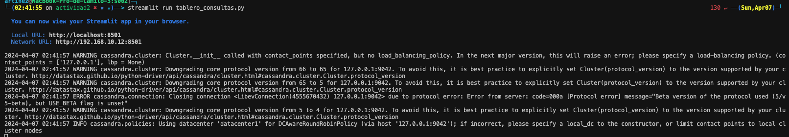

#### Tablero página de inicio.
Note que hay dos botones para poder cargar datos de prueba, y limpiar todos los datos de las tablas. En todas las páginas se encuentran estos botones.

#### Tablero página de consultas.

#### Tablero página de inserciones.

#### Tablero página de inserciones. Inserción de Reservación.

#### Tablero página de actualizaciones.

#### Tablero página de actualizaciones. Actualizar categoria pelicula.

#### Tablero página de eliminaciones.

#### Tablero página de eliminaciones. Eliminación relación Tarjeta Reservación.
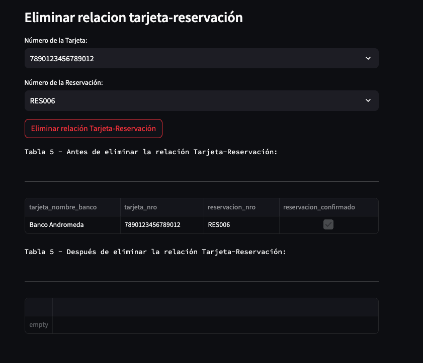

#### Tablero página de consultas. Consulta Tabla 1
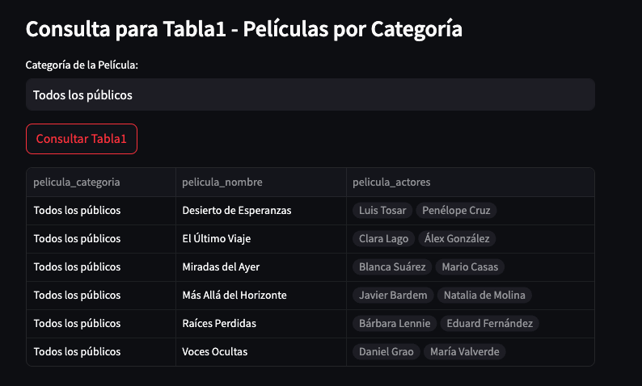

#### Tablero página de consultas. Consulta Tabla 2

#### Tablero página de consultas. Consulta Tabla 3

#### Tablero página de consultas. Consulta Tabla 4
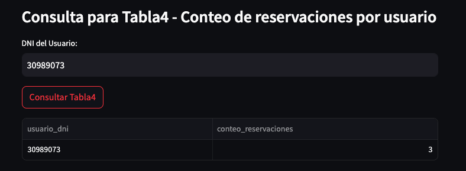

#### Tablero página de consultas. Consulta Tabla 5

#### Tablero página de consultas. Consulta Tabla 6

#### Tablero página de consultas. Consulta Tabla 7

#### Tablero página de consultas. Consulta Tabla 8
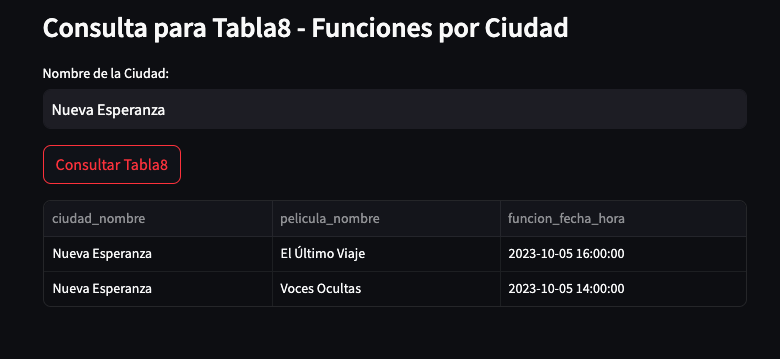

### Terminal:

#### Ejecución de menú por terminal:
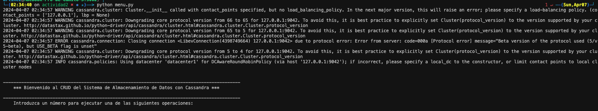

#### Mensaje de bienvenidad con menú:

#### Consulta de usuarios:
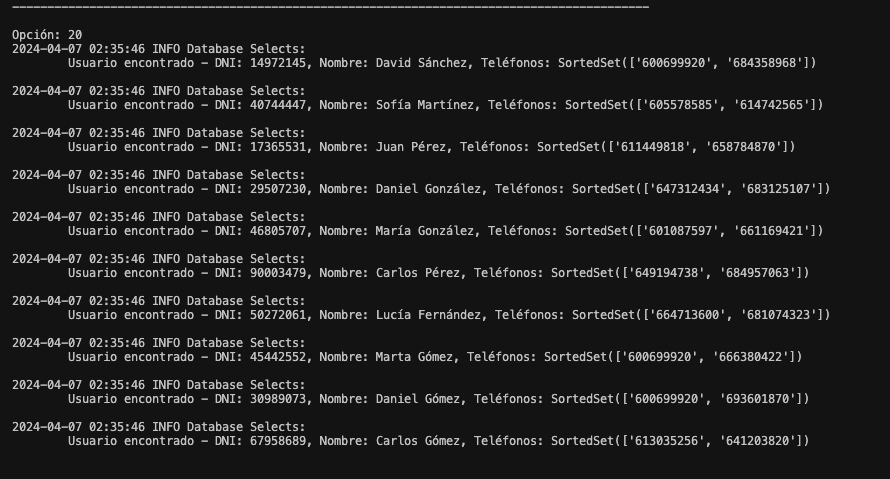

#### Consulta de reservaciones:

### Fragmentros de funciones solicitadas

#### Inserción de datos usuario:

#### Inserción de datos consulta 7:

#### Inserción de datos pelicula:
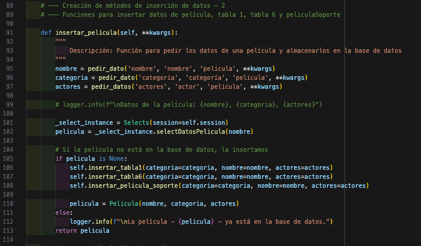

#### Inserción de datos consulta 1:
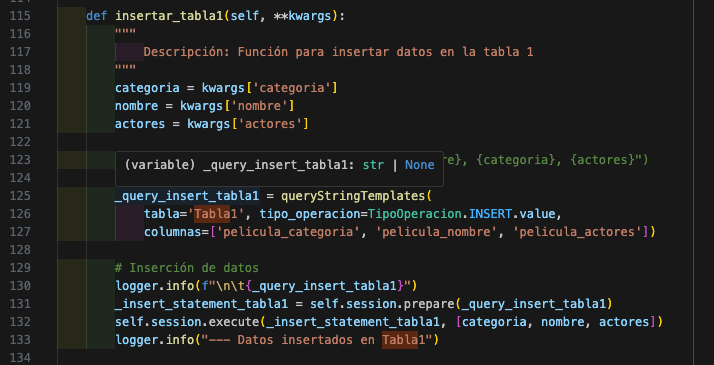

#### Inserción de datos consulta 6:
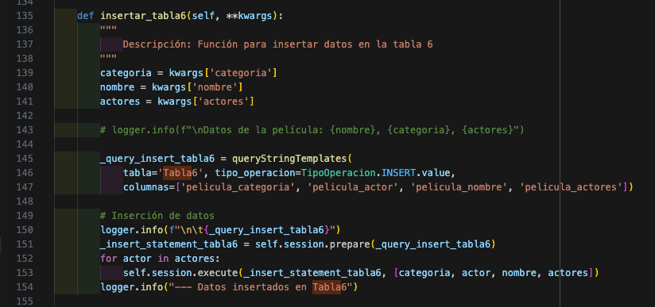

#### Inserción de datos soporte pelicula:

#### Inserción de datos de cine:

#### Inserción de relación Cine Sala - Posee
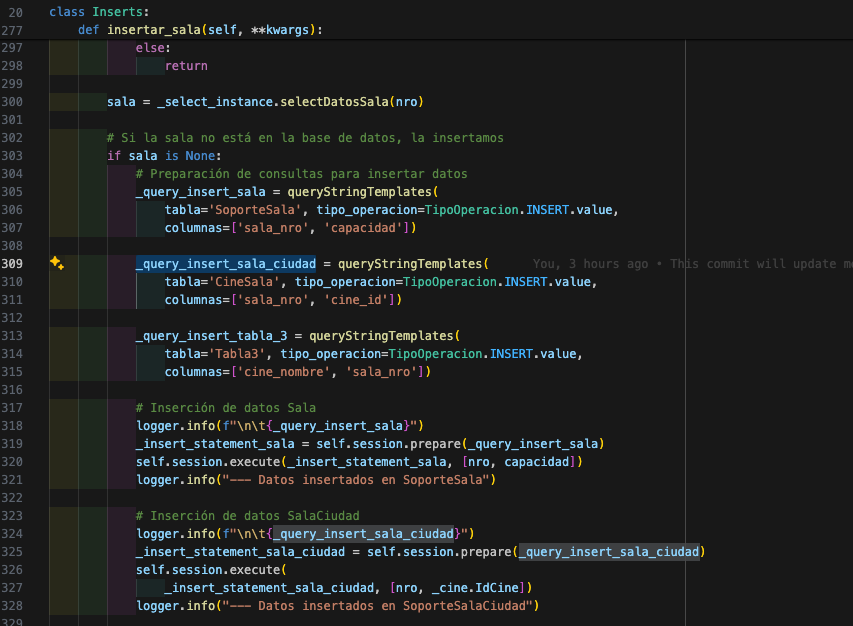

#### Inserción de relación Usuario Reservacion - Reserva, Reservacion Tipo Boleto - Compra
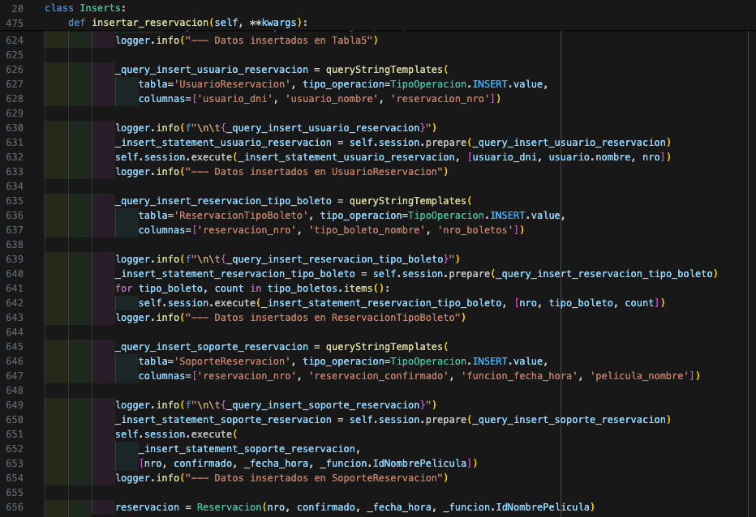

#### Actulización de categoria de pelicula
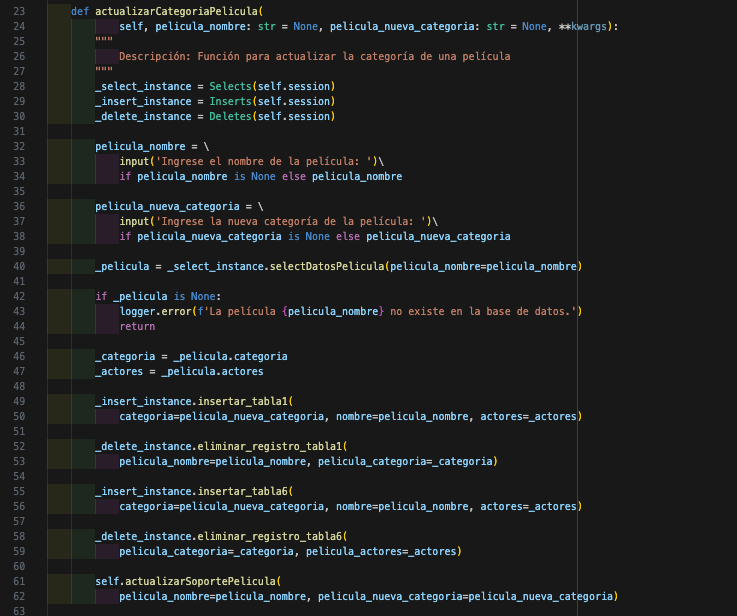

#### Eliminación relación tarjeta y reserva

#### Consultar tabla 5
La clase select es la más amplia, ya que ofrece una gran variedad de consultas. Por simplicidad, solo mostrare una de ellas acá, pero la lógica es muy similar para las demás.
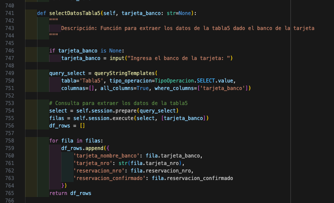

### Siguiente pasos / Mejoras
- Aún se puede mejorar la modularización de funciones dentro del código para reducir código repetido, y facilitar la lectura.
- Se puede robustecer el CRUD.
- Hacer pruebas de altas cargas de datos sinteticos serían interesantes para validar la eficiencia de las tablas.
- El tablero aún se puede mejorar en cuanto a estructura y visuales.
